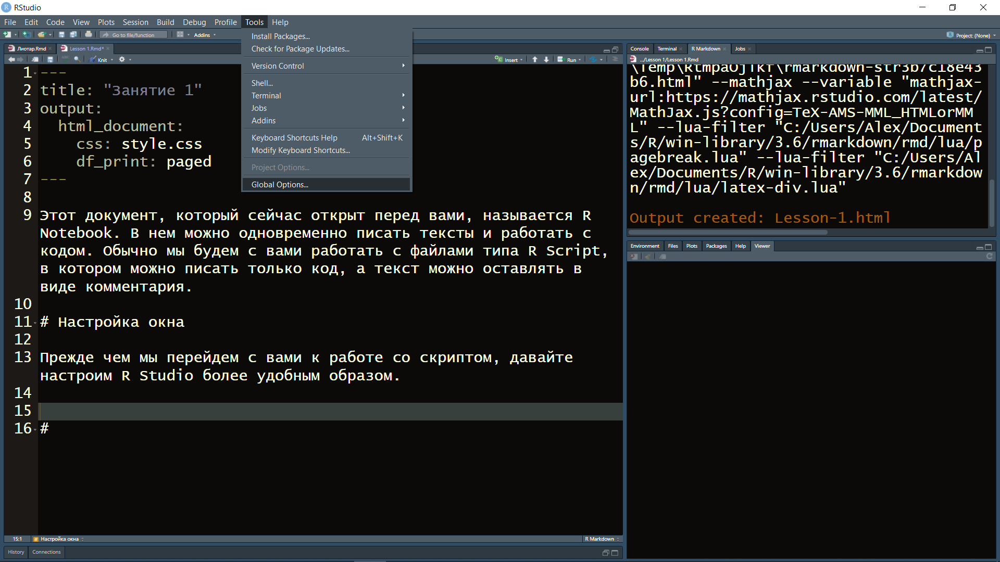
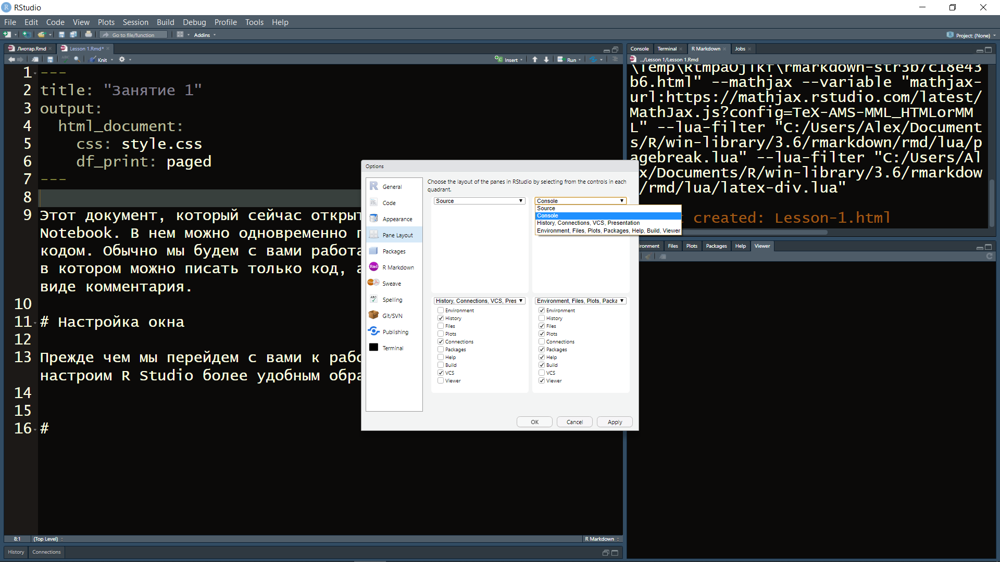
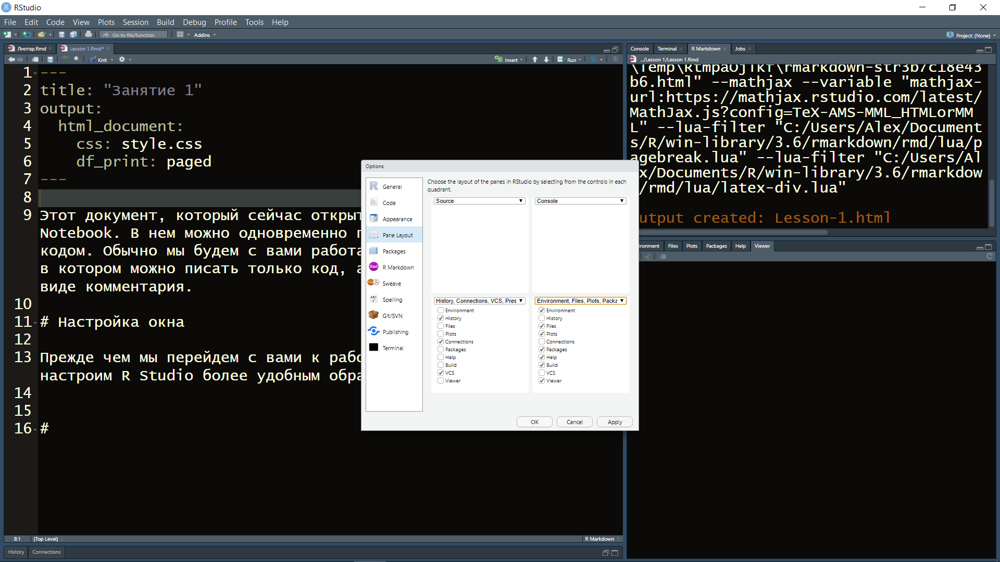
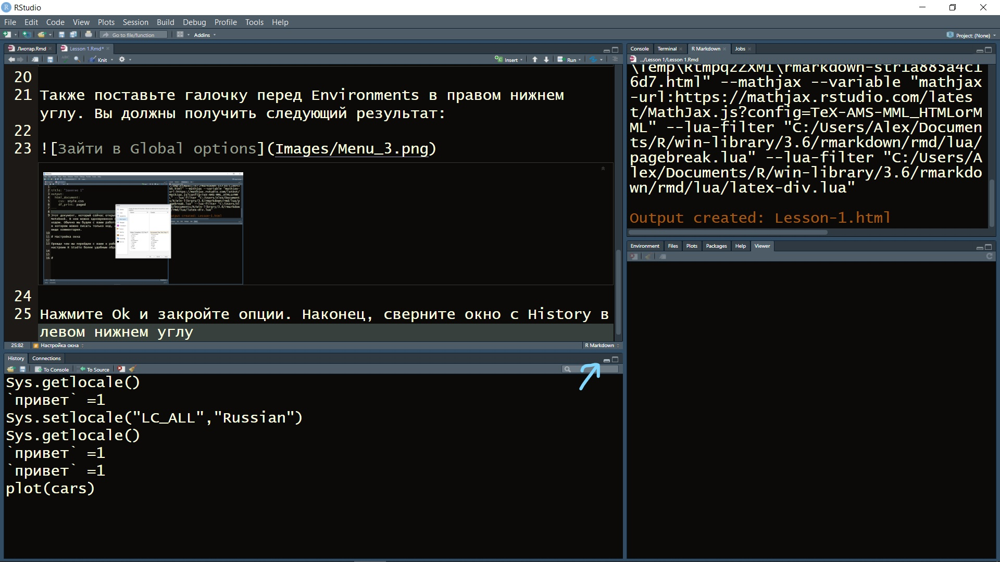
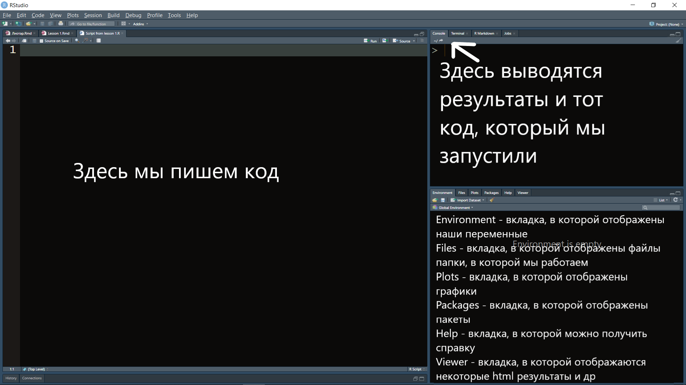
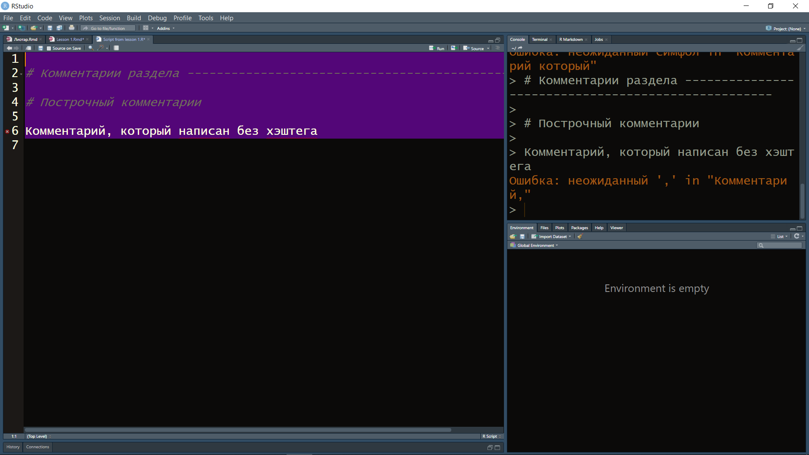

Этот документ, который сейчас открыт перед вами, называется R Notebook. В нем можно одновременно писать тексты и работать с кодом. Обычно мы будем с вами работать с файлами типа R Script, в котором можно писать только код, а текст можно оставлять в виде комментария.

# Настройка окна

Прежде чем мы перейдем с вами к работе со скриптом, давайте настроим R Studio более удобным образом. Для этого зайдем в Global options во вкладке Tools



Здесь выберите окно Console в правом верхнем углу



Также поставьте галочку перед Environments в правом нижнем углу. Вы должны получить следующий результат:



Нажмите Ok и закройте опции. Наконец, сверните окно с History в левом нижнем углу



# Создание R script и знакомство с основными окнами в RStudio

Давайте создадим скрипт с помощью сочетания кнопок Ctrl+Shift+N или через меню в File -> New file -> R script. Сразу сохраним его с помощью горячих клавиш Сtrl+S или через меню File -> Save. 



Между окнами можно переключаться:

  1. Ctrl+Shift+1 - полностью раскроет окно скрипта
  2. Ctrl+Shift+2 - полностью раскроет окно консоли

Вернуться к четырехоконному отображению можно еще раз нажав ctrl+shift+1 или ctrl+shift+2.

# Комментарии

Первое и самое важное правило написания кода - всегда оставляйте комментарии к тому, что вы пишите. На этом курсе мы с вами будем использовать два типа комментариев:

  1. Разделы (создаются с помощью сочетания клавиш Ctrl+Shift+R)
  2. Построчные комментарии (создаются с помощью знака # перед комментарием)
  
Если вы запустите этот код (выделите код и нажмите ctrl+enter или нажмите на Run), то вы увидите в Консоли (правое верхнее окно, что R смог запустить эту команду). 
  
```{r}
# Комментарии раздела ---------------------------------------------------

# Построчный комментарий
```

Давайте теперь напишем какой-нибудь текст в коде и не закомментируем его, чтобы посмотреть, к чему это приведет

```{r eval=F}
# Комментарии раздела ---------------------------------------------------

# Построчный комментарий

Комментарий, который написан без хэштега
```

Вы получите следующую ошибку в консоли:



# Типы и структуры данных

## Основные типы данных:

  1. Числовые (numeric) - числа с точкой (7.0, 5.77 и т.д.)
  2. Целочисленные (integer) - числа без точки (7, 5 и т.д.)
  3. Комплексные (complex) - нафиг не сдались в обычной практике
  4. Строковые (character) - тексты ("а", "привет и пока" и т.д.)
  5. Факторные (factor) - ограниченное количество уникальных числовых или строковых типов данных (гендер, зарплата), так хранятся данные из SPSS например
  6. Логические (logical) - булевы значения (Истина, Ложь)

## Основные структуры данных в R

Гомогенные (могут работать только с одним типом данных):

  1. Вектор, 1 измерение
  2. Матрица, 2 измерения
  3. Массив, n измерений

Гетерогенные (могут работать с несколькими типами данных):
  1. Список, 1 измерение
  2. Датафрейм (Data frame), 2 измерения
  
## Вектора

### Вектор из одного элемента

Напишите цифру 2 и запустите. Консоль выдает вам: [1] 2.
[1] - означает первый элемент в вашей выдачи в консоли, а 2 - это вектор из одного элемента, который вы создали. В R даже один элемент - уже вектор. Это будет очень важно далее.
```{r}
2
```
Давайте посмотрим, к какому типу данных относится этот вектор. Сделать это можно с помощью функции class. 

Функции - это объект в R. Все функции в R запускаются следующим образом: название_функции(аргумент_функции). Иногда функции запускаются без аргументов, и тогда она пишется следующим образом: название_функции(). То есть все функции пишутся с круглыми скобками после своего названия.

Мы хотим проверить, какой класс у вектора, состоящего из одного элемента "2". Давайте проверим:

```{r}
class(2)
```

Мы получили результат "numeric", что означает, что это число с точкой. Все числа, которые мы пишем сами по себе, будут восприниматься как числа с точкой, у которых есть хвост в виде нулей, которые не отображаются в консоли. 

Чтобы получить класс integer (целочисленные), к числам нужно приписывать большую букву L, т.е. написать 2L.

Давайте проверим:
```{r}
class(2L)
```


  
