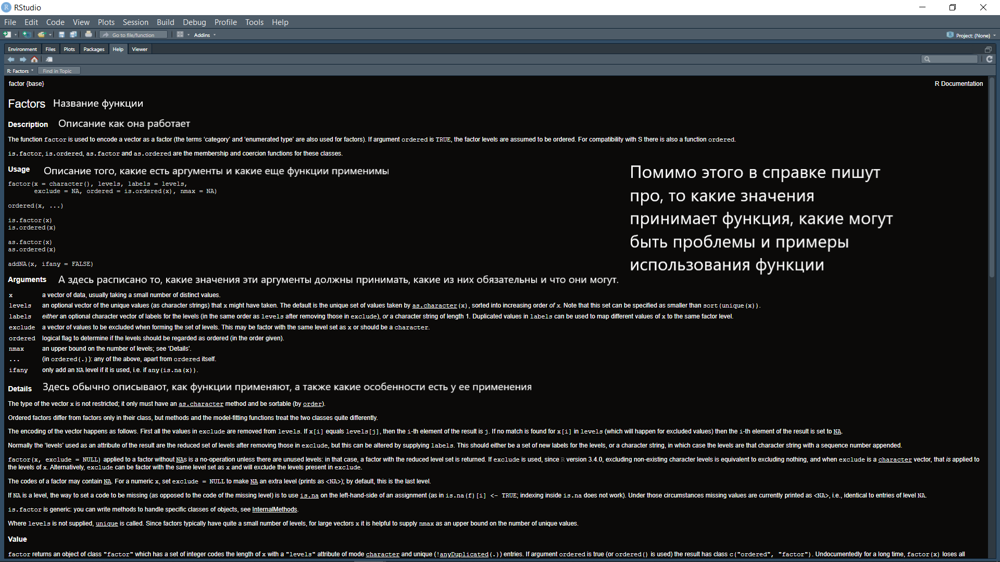
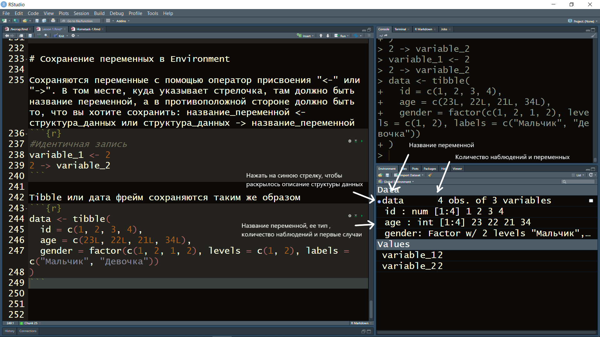

Этот документ, который сейчас открыт перед вами, называется R Notebook. В нем можно одновременно писать тексты и работать с кодом. Обычно мы будем с вами работать с файлами типа R Script, в котором можно писать только код, а текст можно оставлять в виде комментария.

# Настройка окна

Прежде чем мы перейдем с вами к работе со скриптом, давайте настроим R Studio более удобным образом. Для этого зайдем в Global options во вкладке Tools


Здесь выберите окно Console в правом верхнем углу


Также поставьте галочку перед Environments в правом нижнем углу. Вы должны получить следующий результат:


Нажмите Ok и закройте опции. Наконец, сверните окно с History в левом нижнем углу


# Создание R script и знакомство с основными окнами в RStudio

Давайте создадим скрипт с помощью сочетания кнопок Ctrl+Shift+N или через меню в File -> New file -> R script. Сразу сохраним его с помощью горячих клавиш Сtrl+S или через меню File -> Save. 


Между окнами можно переключаться:

  1. Ctrl+Shift+1 - полностью раскроет окно скрипта
  2. Ctrl+Shift+2 - полностью раскроет окно консоли

Вернуться к четырехоконному отображению можно еще раз нажав ctrl+shift+1 или ctrl+shift+2.

# Комментарии

Первое и самое важное правило написания кода - всегда оставляйте комментарии к тому, что вы пишите. На этом курсе мы с вами будем использовать два типа комментариев:

  1. Разделы (создаются с помощью сочетания клавиш Ctrl+Shift+R)
  2. Построчные комментарии (создаются с помощью знака # перед комментарием)
  
Если вы запустите этот код (выделите код и нажмите ctrl+enter или нажмите на Run), то вы увидите в Консоли (правое верхнее окно, что R смог запустить эту команду). 
  
```{r}
# Комментарии раздела ---------------------------------------------------

# Построчный комментарий
```

Давайте теперь напишем какой-нибудь текст в коде и не закомментируем его, чтобы посмотреть, к чему это приведет

```{r eval=F}
# Комментарии раздела ---------------------------------------------------

# Построчный комментарий

Комментарий, который написан без хэштега
```

Вы получите следующую ошибку в консоли:


# Типы и структуры данных

## Основные типы данных:

  1. Числовые (numeric) - числа с точкой (7.0, 5.77 и т.д.)
  2. Целочисленные (integer) - числа без точки (7, 5 и т.д.)
  3. Комплексные (complex) - нафиг не сдались в обычной практике
  4. Строковые (character) - тексты ("а", "привет и пока" и т.д.)
  5. Факторные (factor) - ограниченное количество уникальных числовых или строковых типов данных (гендер, зарплата), так хранятся данные из SPSS например
  6. Логические (logical) - булевы значения (Истина, Ложь)

## Основные структуры данных в R

Гомогенные (могут работать только с одним типом данных):

  1. Вектор, 1 измерение
  2. Матрица, 2 измерения
  3. Массив, n измерений

Гетерогенные (могут работать с несколькими типами данных):
  1. Список, 1 измерение
  2. Датафрейм (Data frame), 2 измерения
  
## Вектора

### Вектор из одного элемента

Напишите цифру 2 и запустите. Консоль выдает вам: [1] 2.
[1] - означает первый элемент в вашей выдачи в консоли, а 2 - это вектор из одного элемента, который вы создали. В R даже один элемент - уже вектор. Это будет очень важно далее.
```{r}
2
```
Давайте посмотрим, к какому типу данных относится этот вектор. Сделать это можно с помощью функции class. 

Функции - это объект в R. Все функции в R запускаются следующим образом: название_функции(аргумент_функции). Иногда функции запускаются без аргументов, и тогда она пишется следующим образом: название_функции(). То есть все функции пишутся с круглыми скобками после своего названия. 

Обратите внимание - функции чувствительны к регистру!

Мы хотим проверить, какой класс у вектора, состоящего из одного элемента "2". Давайте проверим:

```{r}
class(2)
```

Мы получили результат "numeric", что означает, что это число с точкой. Все числа, которые мы пишем сами по себе, будут восприниматься как числа с точкой, у которых есть хвост в виде нулей, которые не отображаются в консоли. 

Чтобы получить класс integer (целочисленные), к числам нужно приписывать большую букву L, т.е. написать 2L.

Давайте проверим:
```{r}
class(2L)
```

Текстовые данные создаются с помощью кавычек и текста в них. Писать можно и через пробелы. "2" будет также восприниматься как character переменная

```{r}
class("text, more text. ")
```

```{r}
class("2")
```

Логические переменные создаются с помощью специальных слов: T и F или TRUE или FALSE. НО: true, True или false, False не cработают.

```{r}
class(T)
```

```{r}
class(FALSE)
```

Наконец, факторы. Факторы создаются с помощью функции factor(). Давайте посмотрим, как они работают с помощью внутренней справки R. Внутренняя справка вызывается с помощью написания знака вопроса перед функцией: ?название_функции()
```{r}
?factor()
```

А теперь давайте создадим простой фактор, в котором цифра "2" будет обозначать "Женский". Обратите внимание на то, что цифра "2" больше не отображается.
```{r}
factor(
  x = 2, 
  levels = 2,
  labels = "Женский"
)
```
Обратите внимание на то, что аргументы (напр., x = 2) можно не прописывать, достаточно просто указать их в том же порядке, в каком они идут. То есть идентичный фактор можно было бы создать и с помощью следующей функции. 
```{r}
factor(2, 2, "Женский")
```
А теперь посмотрим на ее класс.
```{r}
class(factor(2, 2, "Женский"))
```

### Вектор из нескольких элементов 

Самый простой способ создать вектор из нескольких элементов - это использовать функцию c(). Важно! Из-за того, что "с" в русской и англоязычной раскладке выглядит одинаково, то вы можете написать эту функцию из русскоязычной клавиатуры и получить следующую ошибку: "не могу найти функцию "с" ".

Запустим эту функцию для вектора из двух элементов:
```{r}
c(1, 2)
c("text", "text about text")
```

С этого момента становится критичной мысль про то, что вектора всегда бывают только одного типа. Приведу несколько примеров.
```{r}
class(c(1L, 2))
```

```{r}
class(c(1L, 2, "3"))
```

```{r}
class(c(TRUE, F, 1L))
```

```{r}
c(TRUE, F, 1L)
```

```{r}
c(TRUE, F, "2")
```

Отдельно приведу пример с фактором. Пусть у нас будет четыре человека, два мальчика и две девочки. 

```{r}
factor(
  x = c(1, 2, 1, 2),
  levels = c(1, 2),
  labels = c("Мальчик", "Девочка")
)
```


## Датафрейм (Data frame)

Классический датафрейм создается с помощью функции data.frame, однако мы не будем с ней работать, так как у этой функции есть несколько проблем, да и дальше в практике мы будем работать немного в другой парадигме. Вместо data.frame мы будем использовать tibble. 

Для того, чтобы использовать tibble, нам необходимо установить с вами пакет, а потом загрузить его в сессию. Нам нужен пакет под названием tidyverse, а функция, которая устанавливает пакеты - это install.packages().

```{r}
#install.packages("tidyverse")
```

Чтобы загрузить пакет в нынешнюю сессию мы будем использовать функцию library. Обратите внимание, устанавливать пакеты нужно один раз. Иногда их нужно переустанавливать, если вышли новые версии. Однако library нужно использовать каждый раз, когда вы включаете R. Другое важное - если во время установки вы пишите название пакета в кавычках, то в library уже пишете без них.

```{r}
library(tidyverse)
```

А теперь, наконец, создадим tibble. Tibble создается через функцию tibble(), в которой вы прописываете вектора, которые станут **колонками** вашей таблицы. Давайте создадим простой tibble.
```{r}
tibble(
  id = c(1, 2, 3, 4),
  age = c(23L, 22L, 21L, 34L),
  gender = factor(c(1, 2, 1, 2), levels = c(1, 2), labels = c("Мальчик", "Девочка"))
)
```

# Сохранение переменных в Environment

Сохраняются переменные с помощью оператор присвоения "<-" или "->". В том месте, куда указывает стрелочка, там должно быть название переменной, а в противоположной стороне должно быть то, что вы хотите сохранить: название_переменной <- структура_данных или структура_данных -> название_переменной
```{r}
#Идентичная запись
variable_1 <- 2
2 -> variable_2
```

Tibble или дата фрейм сохраняются таким же образом
```{r}
data <- tibble(
  id = c(1, 2, 3, 4),
  age = c(23L, 22L, 21L, 34L),
  gender = factor(c(1, 2, 1, 2), levels = c(1, 2), labels = c("Мальчик", "Девочка"))
)
```



# Удаление переменных из Environment

Переменные удаляются с помощью функции rm(название_переменной_в_Environment). Например, rm(data). Если хочется удалить все переменные из Environment, то это можно сделать с помощью команды rm(list = ls()).

Обратите внимание, эти команды необратимы!


